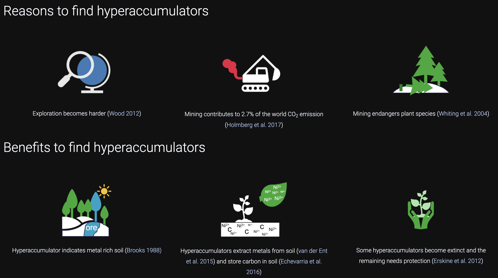

# Novel Spectroscopies for Metallome Analysis of Trace Element: Hyperaccumulator Plants

This repository contains the materials and information related to my PhD presentation that took place on October 19, 2023. The presentation page can be seen here: [LINK](https://1mampurwad1.github.io/thesis_presentation/#slide=1) or download this repo and run *index.html* in your browser. The presentation focused on the research work I conducted during my doctoral studies. Below, you can find a summary of the chapters and associated publications:

## Chapter 1: Tools for the Discovery of Hyperaccumulator Plant Species
- **Title:** [Tools for the Discovery of Hyperaccumulator Plant Species in the Field and in the Herbarium](https://link.springer.com/chapter/10.1007/978-3-030-58904-2_9)
- **Published in:** [Agromining: Farming for Metals, 2nd edition (Springer)](https://link.springer.com/book/10.1007/978-3-030-58904-2)
- **Year:** 2021
- **Content:** Literature review

- **Description:** It delves into the fundamental question of why it is crucial to identify hyperaccumulator plant species. The strategies employed for their discovery are explored, along with the development of the necessary methodology. This chapter provides insights into the motivation, approach, and methodological foundations that underpin the study of hyperaccumulator plants.

## Chapter 3: X-ray Fluorescence Spectroscopy for Metallome Analysis of Herbarium Specimens
- **Title:** [X-ray fluorescence spectroscopy for metallome analysis of herbarium specimens](https://plantmethods.biomedcentral.com/articles/10.1186/s13007-022-00958-z)
- **Published in:** [Plant Methods](https://plantmethods.biomedcentral.com/)
- **Year:** 2022
- **Content:** Method development

- **Description:** It is dedicated to method development, specifically focusing on the use of X-ray fluorescence (XRF) instruments for quantifying metals in herbarium specimens. Additionally, the chapter delves into the intricacies of estimating the matrix density and thickness of herbarium specimens. It lays the groundwork for the quantitative analysis of metal content in these historical plant samples.

## Chapter 4: A Systematic Assessment of the Metallome of Selected Plant Families in Queensland
- **Title:** [A systematic assessment of the metallome of selected plant families in the Queensland (Australia) flora using X-ray fluorescence spectroscopy](https://www.publish.csiro.au/bt/BT22028)
- **Published in:** [Australian Journal of Botany](https://www.publish.csiro.au/bt/BT22028)
- **Year:** 2023
- **Content:** The application of the developed method

- **Description:** Building upon the method developed in Chapter 3, this chapter explores the practical application of this technique. The developed method proves its worth by successfully recovering more information and identifying previously missed hyperaccumulator plants. Furthermore, spatial analysis is conducted to understand the distribution of hyperaccumulators, shedding light on their geographical patterns and prevalence.

## Chapter 5: Recognition of Trace Element Hyperaccumulation Based on Empirical Datasets
- **Title:** [Recognition of trace element hyperaccumulation based on empirical datasets derived from XRF scanning of herbarium specimens](https://link.springer.com/article/10.1007/s11104-023-06185-2)
- **Published in:** [Plant and Soil](https://link.springer.com/article/10.1007/s11104-023-06185-2)
- **Year:** 2023
- **Content:** The application of the developed method

- **Description:** This chapter continues to build upon the method developed in Chapter 3. It revisits the established hyperaccumulator threshold and discusses the analysis of a substantial dataset comprising 27,000 XRF scans from four different countries. The chapter also addresses the challenge of dealing with non-detected values and concludes that no modifications are needed for historical hyperaccumulator thresholds.

## Chapter 6: Portable X-ray Fluorescence (XRF) Spectroscopy for Intact Dry Leaves
- **Title:** Portable X-ray fluorescence (XRF) spectroscopy for intact dry leaves
- **Status:** Under revision, submitted to [Ecological Research](https://esj-journals.onlinelibrary.wiley.com/journal/14401703)
- **Year:** 2023
- **Content:** The application of the developed method

- **Description:** This chapter further explores the practical application of the method developed in Chapter 3. It contemplates the potential future use of different instruments for herbarium XRF scanning and raises the question of whether the developed method can standardize or make results from various instruments comparable. The focus is on ensuring the robustness and adaptability of the methodology.

## Chapter 7: Reflectance Spectroscopy as a Promising Tool for 'Sensing' Metals in Hyperaccumulator Plants
- **Title:** [Reflectance spectroscopy as a promising tool for 'sensing' metals in hyperaccumulator plants](https://link.springer.com/article/10.1007/s00425-023-04167-3)
- **Published in:** [Planta](https://link.springer.com/article/10.1007/s00425-023-04167-3)
- **Year:** 2023
- **Content:** Exploring other possibilities

- **Description:** This chapter explores the intriguing potential of remote sensing in identifying hyperaccumulator plants. It delves into the distinct behavior of nickel hyperaccumulator leaves when reflecting sunlight, which sets them apart from normal plants. This chapter demonstrates the use of remote sensing as a promising tool for distinguishing hyperaccumulators based on their unique optical characteristics.

## Presentation Date
- Date: October 19, 2023

## About Me
- I did my PhD at [The University of Queensland - Sustainable Minerals Institute (SMI)](https://smi.uq.edu.au/).

## Contact Information
- [LinkedIn](https://www.linkedin.com/in/imampurwadi/)
- [ResearchGate](https://www.researchgate.net/profile/Imam-Purwadi-3)
- [Email](mailto:imampurwadi312@gmail.com)

## Acknowledgments
I would like to express my gratitude to everyone who has been part of this journey, including my advisors, examiners, supervisors, laboratory team, collaborators, and the Center for Mined Land Rehabilitation at SMI. Your support and encouragement have been invaluable.

I would like to express my special thanks to the following individuals who have been part of this journey and provided invaluable support and encouragement:

- **Chairman:** [Dr. Nathan Fox](https://smi.uq.edu.au/profile/4672/nathan-fox)
- **Examiner:** [Prof. Hudson W. P. de Carvalho](https://scholar.google.com/citations?user=7BQg-SAAAAAJ&hl=en)
- **Examiner:** [Dr. Mark J Hackett](https://scholar.google.com/citations?user=KY6tsboAAAAJ&hl=en)

**Supervisors:**
- [Dr. Antony van der Ent](https://www.researchgate.net/profile/Antony-Ent)
- [Prof. Peter D. Erskine](https://www.researchgate.net/profile/Peter-Erskine)
- [Dr. Lachlan Casey](https://www.researchgate.net/profile/Lachlan-Casey)

**Laboratory Team:**
- [Mr. Vinod Nath](https://www.researchgate.net/profile/Vinod-Nath)
- [Ms. Vanessa Glenn](https://www.researchgate.net/profile/Vanessa-Glenn-2)
- [Ms. Natasha Ufer](https://smi.uq.edu.au/profile/3428/natasha-ufer)

**Collaborators:**
- [Prof. Guillaume Echevarria](https://www.researchgate.net/profile/Guillaume-Echevarria)
- [Dr. Wojciech J Przybyłowicz](https://www.researchgate.net/profile/Wojciech-Przybylowicz)
- [Dr. Jolanta Mesjasz-Przybyłowicz](https://www.researchgate.net/profile/Jolanta-Mesjasz-Przybylowicz)
- [Dr. Chris G. Ryan](https://www.researchgate.net/profile/Chris-Ryan-5)
- [Dr. Gillian Kim Brown](https://www.researchgate.net/profile/Gillian-Brown-8)

**The family of the Centre for Mined Land Rehabilitation at SMI:**
- [Dr. Philip Nti Nkrumah](https://www.researchgate.net/profile/Philip-Nkrumah)
- [Dr. Adrian Paul](https://www.researchgate.net/profile/Adrian-Paul)
- [Dr. Farida Abubakari](https://www.researchgate.net/profile/Farida-Abubakari)
- [Dr. Roger Tang](https://www.researchgate.net/profile/Roger-Tang-2)
- [Dr. Amelia Corzo Remigio](https://www.researchgate.net/profile/Amelia-Corzo-Remigio)
- [Dr. Maggie-Anne Harvey](https://www.researchgate.net/profile/Maggie-Anne-Harvey)
- [Dr. Vidiro Gei](https://www.researchgate.net/profile/Vidiro-Gei)
- [Katherine Pinto Irish](https://www.researchgate.net/profile/Katherine-Pinto-Irish)

These presentation slides were created using various open-source tools and data, including [WebSlides](https://github.com/webslides/WebSlides) for the presentation template, [LeafletJS](https://leafletjs.com/) for maps, [Chart.js](https://www.chartjs.org/) for charts, [Font Awesome](https://fontawesome.com/) for icons, and [Freepik](https://www.freepik.com/) for images.

Thank you for your interest in my research and presentation!
